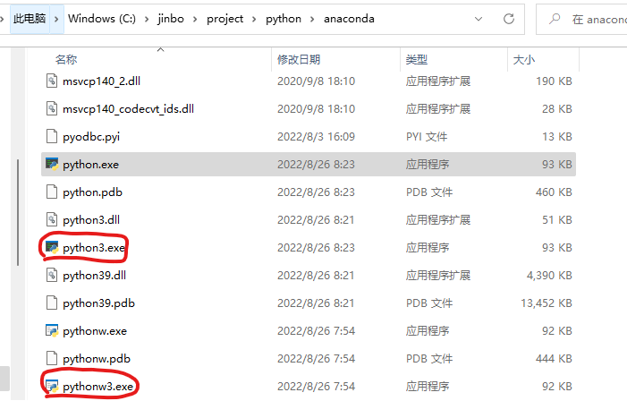

## windows 上的环境配置

### 安装 turtle

首先使用 pip3 或者 conda 安装 turtle 会下载失败，去[pypi](https://pypi.org/)下载包turtle 。

下载完成后，解压

```shell
tar -xvf turtle-0.0.2.tar.gz
cd turtle-0.0.2
```

继续安装会提示错误：`Command "python setup.py egg_info" failed with error code 1`，仔细查看安装turtle出错的错误信息，可以看到是个语法错误。

打开 setup.py 文件，第 40 行修改为

```python
 except (ValueError, ve):
```

 原因是Python2的写法，没有括号，加了括号之后Python3就能用了。

cd ../ 后再次安装

```shell
pip3 install -e turtle-0.0.2
```

安装过程中可能会出错，因为依赖 Twisted 找不到，[那么可以在 pip3 后面加上国内的源](https://blog.csdn.net/JineD/article/details/124774570)，例如

```shell
方法一：pip install 安装包名字 -i http://pypi.doubanio.com/simple/ --trusted-host pypi.doubanio.com //豆瓣镜像网站

方法二：pip install 安装包名字 -i http://pypi.douban.com/simple/ --trusted-host pypi.douban.com //豆瓣

方法三：pip install 安装包名字 -i https://pypi.tuna.tsinghua.edu.cn/simple/ --trusted-host pypi.tuna.tsinghua.edu.cn //清华大学
```

```shell
# 安装 twisted
pip3 install Twisted-22.4.0-py3-none-any.whl -i https://pypi.tuna.tsinghua.edu.cn/simple/ --trusted-host pypi.tuna.tsinghua.edu.cn
```

### 安装 opencv

```shell
conda install opencv
```

### [解决执行 python3 会打开应用商店的问题](https://blog.csdn.net/nihe001/article/details/128338799)

找到 python 环境变量目录，复制 python.exe 和 pythonw.exe，并更名为python3.exe 和 pythonw3.exe，即可解决。因为 windows 下的解释器以python命令，不同于 linux 下用 python3 命名。



## 打包

```shell
# #安装 pyinstaller
pip3 install pyinstaller

# 打包，就这一条命令就可以了
pyinstaller -F test.py -n myexe -i qianxun.ico 
# 注意图标必须是 ico 否则会报错 
# 报错信息 AttributeError: module ‘win32ctypes.pywin32.win32api‘ has no attribute ‘error‘
# 解决方式, 访问 把你的图片转为ico, 再 PyInstaller 即可
```

